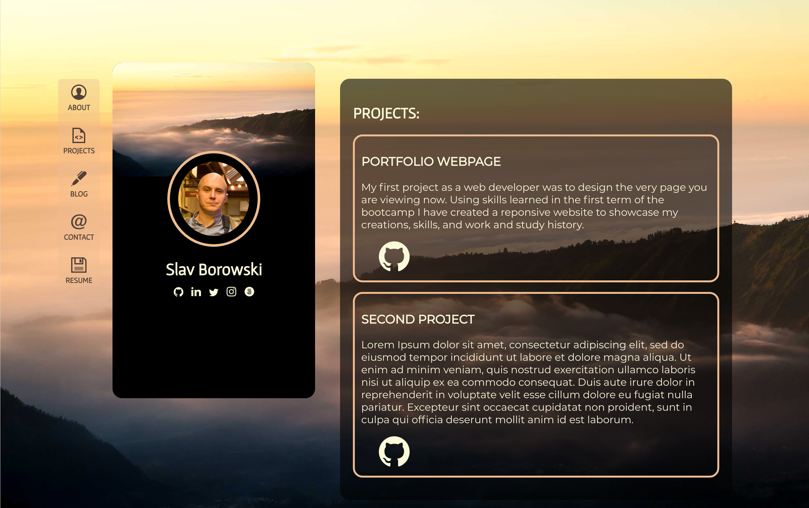

# Published Portfolio Website 

## Deployed Website

[Click here to visit my site.](https://slavborowski.netlify.app/)

## Portfolio Ed Workspace

[Click here to visit my Ed workspace.](https://edstem.org/courses/4464/workspaces/pNU38Huum4SbIImgr49DGzV1r2Og4tjn)

## Purpose

The purpose of this project was to develop a website which would showcase my skills, experience and a portfolio of projects to potential employers and clients.

## Functionality/features

The website was deisgned to be responsive. It will change to the narrow mobile/tablet deisgn when screen size drops below 960px.

The profile card and navbar remain stationary in desktop view while the main content to the right scrolls as required.

In mobile/tablet the navbar becomes horizontal and sticks to the top of the page while all other content scrolls.

## Sitemap

## Screenshots

## Target Audience

The target audience for this project was web development companies looking for potential employees.

## Tech Stack

The technology used in the creation of this page was:
- HTML
- CSS
- Netlify
- Adobe Lightroom
- GNU Image Manipulation Program (GIMP)
- Github

